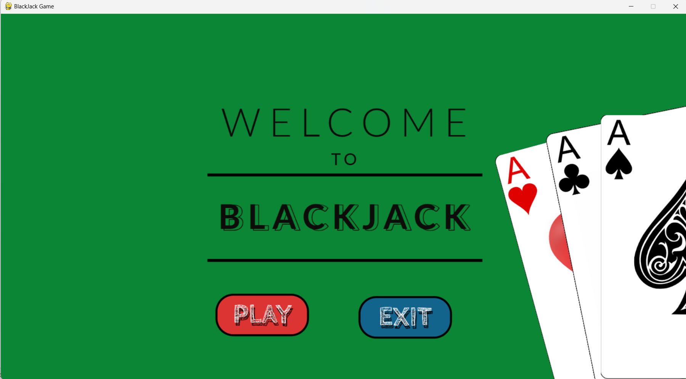
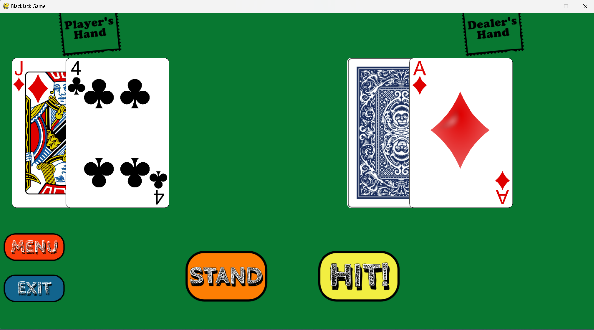

# Blackjack Game with Python and Pygame

## Overview

This is a simple implementation of the classic Blackjack card game using Python and the Pygame library. The game allows players to play Blackjack against a dealer and try to get as close to 21 points without going over. Aces can count as 1 or 11, and the dealer hits until their hand value reaches 17.

## Features

- Interactive GUI using Pygame for an engaging user experience.
- Player can place bets and make decisions to hit or stand.
- Dealer's actions are automated according to game rules.
- Player's and dealer's cards are displayed during the game.
- Player's chip balance is tracked, and they can play multiple rounds.
- Clear instructions provided on the game's rules and actions.

## Prerequisites

- Python 3.x
- Pygame library (`pip install pygame`)

## How to Run

1. Clone this repository:

    ```
    git clone https://github.com/eleni-mts/BlackJack-Game.git
    cd blackjack-game
    ```

2. Install the required library:

    ```
    pip install pygame
    ```

3. Run the game:

    ```
    python BlackJack.py
    ```

## How to Play

1. Launch the game using the steps above.

2. Follow the on-screen instructions to:
    - Place your bet.
    - Choose to hit or stand during your turn.
    - See the dealer's actions.

3. The game will display the outcome of each round, and your chip balance will be updated accordingly.

4. Play as many rounds as you like!

## Screenshots




